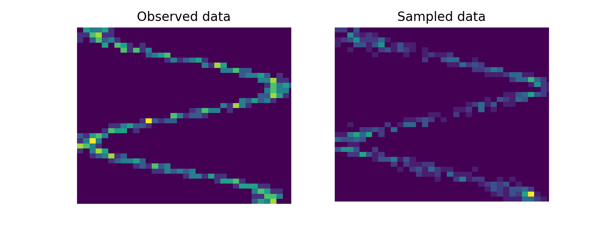

### Mixture Density Networks in PyTorch

Last update: March 2019

---

Lightweight implementation of a mixture density network [1] in PyTorch.

An MDN models the conditional distribution over a scalar response as a mixture of Gaussians.
$$
p_\theta(y|x) = \sum_{k=1}^K \pi^{(k)} \mathcal{N}(\mu^{(k)}, {\sigma^2}^{(k)}),
$$
where the mixture distribution parameters are output by a neural network, trained to maximize overall log-likelihood. The set of mixture distribution parameters is
$$
\{\pi^{(k)}, \mu^{(k)}, {\sigma^2}^{(k)}\}_{k=1}^K
$$

In order to predict the response as a multivariate Gaussian distribution (for example, in [2]), we assume a fully factored distribution (i.e. a diagonal covariance matrix) and predict each dimesion separately. Another possible approach would be to use an auto-regressive method like in [3], but we leave that implementation for future work.

#### Usage

```python
import torch
from mdn.model import MixtureDensityNetwork
from mdn.utils import mixture_density_loss, sample_gaussian_mixture

x = torch.randn(5, 1)
y = torch.randn(5, 1)

# 1D input, 1D output, 3 mixture components
model = MixtureDensityNetwork(1, 1, 3)
pred_parameters = model(x)

# use this to backprop
loss = mixture_density_loss(y, pred_parameters)

# use this to sample a trained model
samples = sample_gaussian_mixture(pred_parameters)
```

For further details see the `examples/` folder. Below is a model fit in `ex_1d.py`.



#### References

[1] Bishop, C. M. Mixture density networks. (1994).

[2] Ha, D. & Schmidhuber, J. World Models. *arXiv:1803.10122 [cs, stat]* (2018).

[3] Van Den Oord, A., Kalchbrenner, N. & Kavukcuoglu, K. Pixel Recurrent Neural Networks. in *Proceedings of the 33rd International Conference on International Conference on Machine Learning - Volume 48* 1747–1756.

#### License

This code is available under the MIT License.
